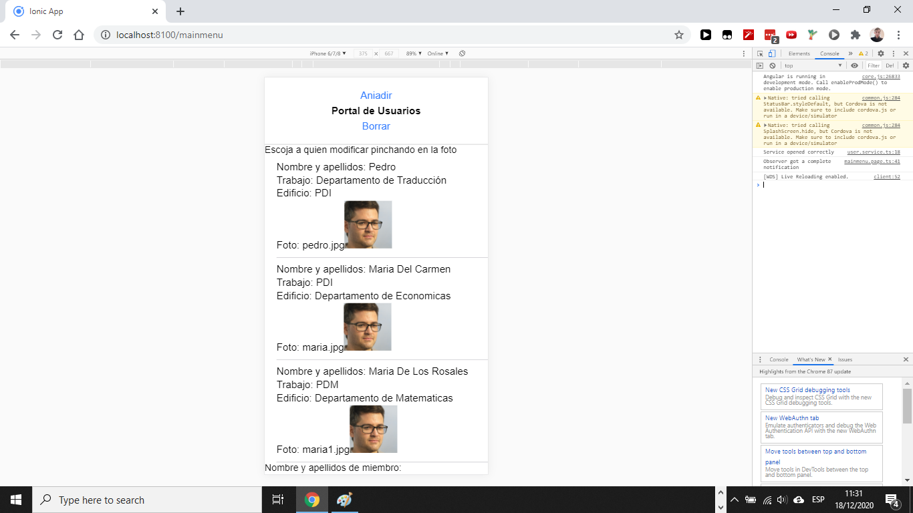
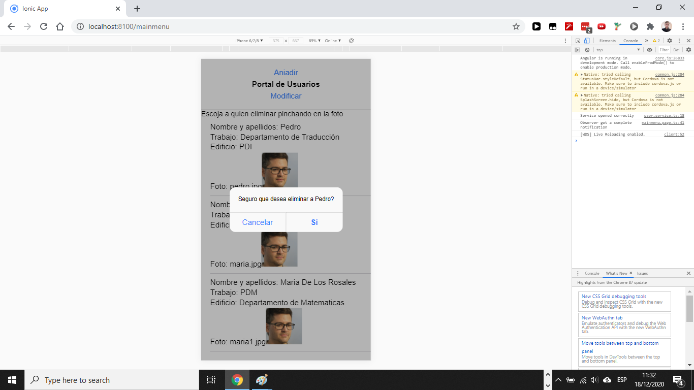
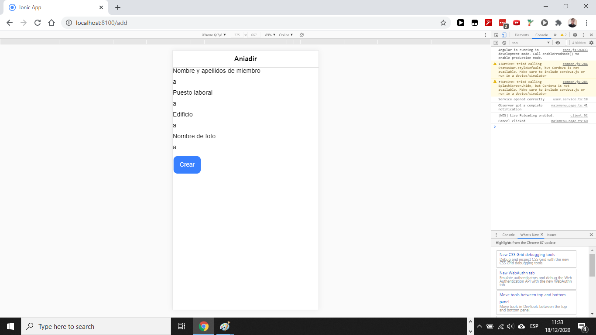
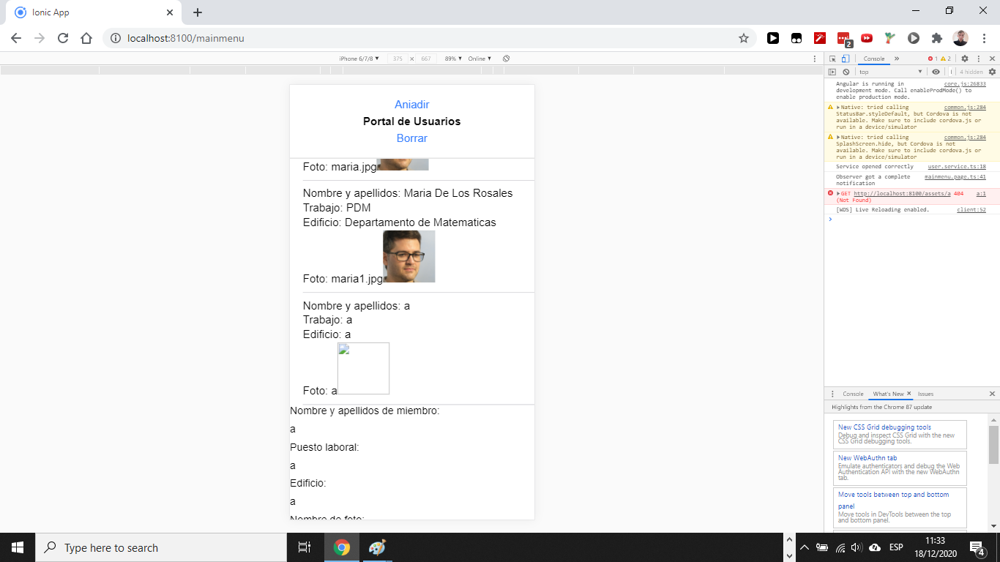
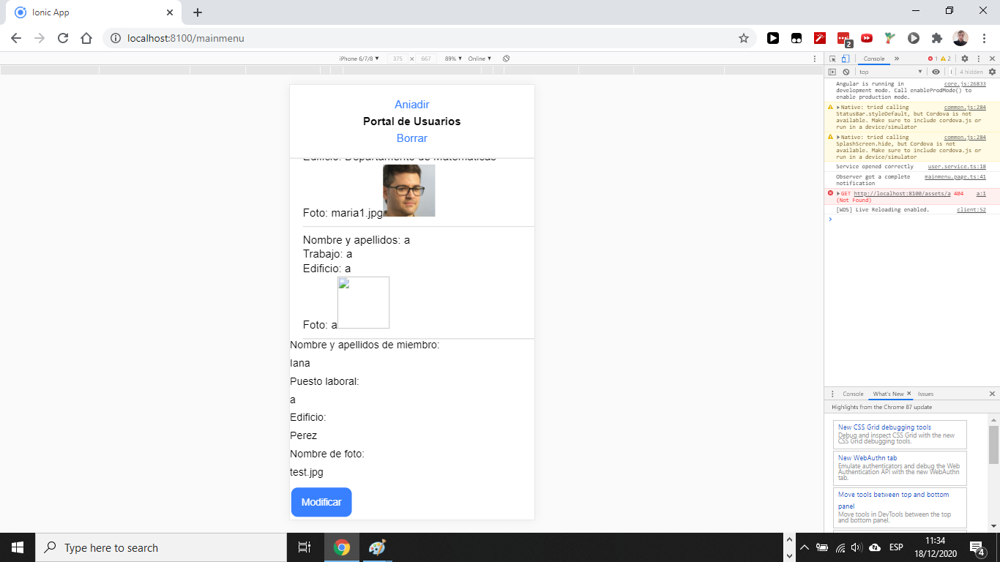
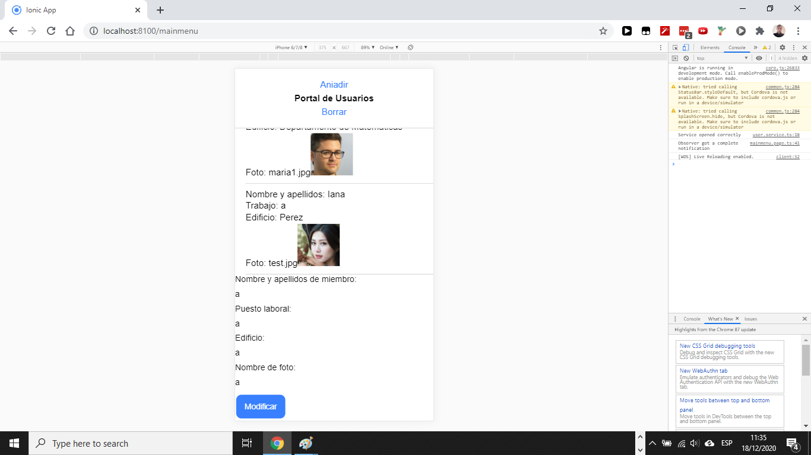
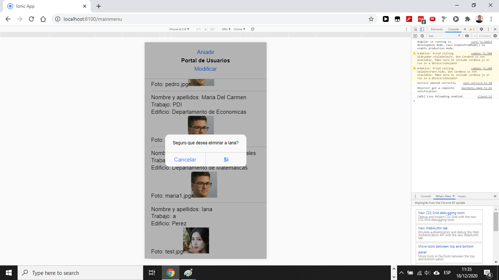

# Portal de Usuarios

Esta aplicación consiste en un CRUD que permite la creación, modificación, eliminación y visualización de personal en una universidad genérica, con el objetivo de generar páginas de listado de usuarios de forma rápida y sencilla para el usuario final. (Última actualización, ahora los botones de borrar y modificar incluyen función de actualización de página, su nombre ahora es "Borrar y Actualizar" y "Modificar y Actualizar")

Menú de inicio

Tras presionar Delete

Tras presionar en una foto habiendo presionado Delete

Tras presionar Create

Tras crear un nuevo usuario y pinchar en la fotografía de ese usuario

Tras pinchar en la fotografía del usuario y modificar los contenidos

Tras modificar los contenidos

Tras presionar Delete y pinchar en la fotografía del usuario

Tras eliminar al usuario
