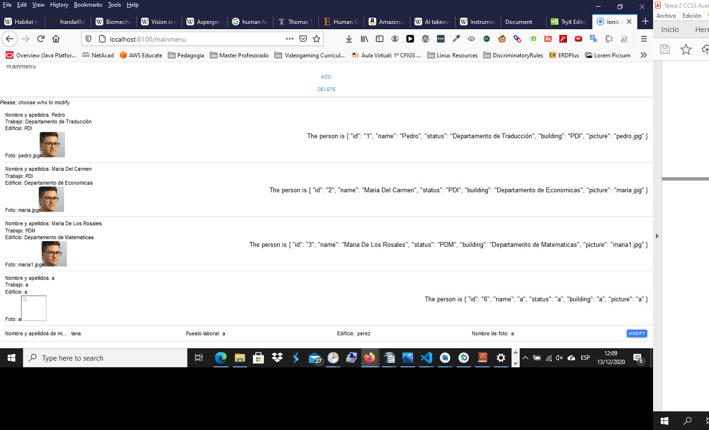

# Portal de Usuarios

Menú de inicio

Tras presionar Delete

Tras presionar en una foto habiendo presionado Delete

Tras presionar Create

Tras crear un nuevo usuario y pinchar en la fotografía de ese usuario

Tras pinchar en la fotografía del usuario y modificar los contenidos

Tras modificar los contenidos

Tras presionar Delete y pinchar en la fotografía del usuario

Tras eliminar al usuario
